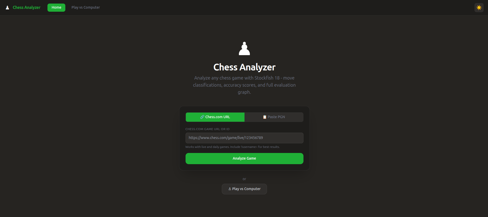

# Chess Analyzer

A full-stack chess analysis web app powered by **Stockfish 18**, replicating chess.com's move classification and accuracy model.



---

## Features

- **Analyze any game** — paste a Chess.com URL or raw PGN
- **Move classification** — Brilliant · Great · Book · Best · Excellent · Good · Inaccuracy · Mistake · Miss · Blunder
- **CAPS2 accuracy score** — chess.com's win-probability-based scoring algorithm
- **Win probability graph** — logistic eval graph (0–100%) matching chess.com's Expected Points model
- **Evaluation bar** — live position bar driven by win probability, not linear centipawns
- **Opening detection** — ECO code + opening name from PGN headers
- **Play vs computer** — adjustable difficulty from Beginner to Master
- **Post-game review** — full Stockfish analysis after any play-vs-computer game
- **AI commentary** — optional natural-language move explanations via local Ollama (Llama)

---

## Stack

| Layer    | Tech |
|----------|------|
| Frontend | React 18 · Vite · TailwindCSS · Chart.js · react-chessboard |
| Backend  | Python 3.12 · FastAPI · python-chess · Stockfish 18 |

---

## Quick Start

### 1. Install Stockfish

**Ubuntu / Debian**
```bash
sudo apt update && sudo apt install -y stockfish
```

**macOS**
```bash
brew install stockfish
```

**Windows** — Download from https://stockfishchess.org/download/ and note the path.

---

### 2. Backend

```bash
cd backend
python3 -m venv .venv && source .venv/bin/activate
pip install -r requirements.txt

# If Stockfish is not on PATH, set the env variable:
# export STOCKFISH_PATH=/path/to/stockfish

uvicorn main:app --reload --port 8000
```

API docs → http://localhost:8000/docs

---

### 3. Frontend

```bash
cd frontend
npm install
npm run dev
# Opens at http://localhost:5173
```

---

### 4. (Optional) AI Commentary via Ollama

The app can generate natural-language move commentary using a locally running Llama model. Without Ollama the app works fine — commentary falls back to built-in template descriptions.

**Install Ollama**

```bash
# Ubuntu / Debian / WSL
curl -fsSL https://ollama.com/install.sh | sh

# macOS
brew install ollama
```

**Windows** — Download the installer from https://ollama.com/download

**Pull a model** (choose one)

```bash
ollama pull llama3.2        # Recommended — fast on CPU, good quality
ollama pull llama3.1        # Better reasoning, needs more RAM
ollama pull llama3.2:1b     # Smallest / fastest
```

**Start the server**

```bash
ollama serve                # Runs at http://localhost:11434
```

The backend auto-detects Ollama on each request — no restart needed. In the app, click any move then press **Get AI Commentary** to generate a coach-style explanation.

---

## Usage

### Analyze a Game
1. Open http://localhost:5173
2. Paste a Chess.com game URL or raw PGN
3. Click **Analyze Game**
4. Navigate moves with ← → arrow keys or by clicking the move list
5. Click **Get AI Commentary** on any move for a deeper explanation (requires Ollama)

### Play vs Computer
1. Click **Play vs Computer** in the navbar
2. Choose your color and difficulty (Beginner → Master)
3. Click a piece to select, then click a destination — or drag and drop
4. Press **H** to toggle a move hint
5. After the game click **Review with Analysis** for a full Stockfish post-mortem

---

## Project Structure

```
Chess/
├── README.md
├── LICENSE
├── .gitignore
├── images/
│   └── home.png                    # App screenshot
│
├── backend/
│   ├── main.py                     # FastAPI app, CORS, router registration
│   ├── engine.py                   # Async Stockfish wrapper (cached, singleton)
│   ├── analyzer.py                 # Full-game analysis, CAPS2 accuracy, move classification, commentary
│   ├── requirements.txt
│   ├── .env.example                # Environment variable template
│   └── routes/
│       ├── analyze.py              # POST /analyze-game-stream · /analyze-position · /commentary
│       └── play.py                 # POST /play-move · /evaluate
│
└── frontend/
    ├── index.html
    ├── vite.config.js
    ├── tailwind.config.js
    ├── postcss.config.js
    ├── package.json
    └── src/
        ├── App.jsx                 # Routing, navbar, theme toggle
        ├── main.jsx                # React entry point
        ├── index.css               # Global styles & CSS variables
        ├── context/
        │   └── ThemeContext.jsx    # Dark / light theme provider
        ├── pages/
        │   ├── Home.jsx            # URL / PGN input & game submission
        │   ├── AnalysisPage.jsx    # Board · eval graph · move list · commentary
        │   └── PlayPage.jsx        # Play vs computer
        ├── components/
        │   ├── EvalBar.jsx         # Vertical win-probability evaluation bar
        │   ├── EvalGraph.jsx       # Win-probability chart (0–100%)
        │   ├── MoveList.jsx        # Scrollable move list with classification badges
        │   ├── GameSummary.jsx     # Accuracy scores & classification counts table
        │   └── LoadingSpinner.jsx  # Shared loading indicator
        └── utils/
            ├── api.js              # HTTP client (axios + SSE streaming)
            ├── chess.js            # Classification metadata, symbols, colors & helpers
            └── useBoardSize.js     # Responsive board size hook
```

---

## How Classification Works

Moves are scored using chess.com's **Expected Points** (win probability) model:

```
win_prob(cp) = 1 / (1 + e^(−0.00368208 × cp))
```

The **ΔQ** (delta Q) for each move is the win-probability loss from the mover's perspective. Classifications map to ΔQ thresholds:

| Classification | ΔQ threshold |
|----------------|-------------|
| Brilliant      | Best move + material sacrifice |
| Great          | Best move + tactical/defensive swing |
| Book           | ΔQ < 2% within unbroken opening sequence |
| Best           | Engine's top choice (or ΔQ = 0) |
| Excellent      | ΔQ < 2% |
| Good           | ΔQ < 5% |
| Inaccuracy     | ΔQ < 10% |
| Mistake        | ΔQ < 20% |
| Miss           | ΔQ ≥ 10% after opponent's Blunder |
| Blunder        | ΔQ ≥ 20% |

**CAPS2 accuracy** is calculated as:

```
accuracy = 103.1668 × e^(−3 × avg_ΔQ) − 3.1668
```

Book moves are excluded from the accuracy calculation (they are opening theory, not player decisions).

---

## Environment Variables

| Variable | Default | Description |
|----------|---------|-------------|
| `STOCKFISH_PATH` | auto-detected | Full path to the Stockfish binary |
| `ANALYSIS_DEPTH` | `15` | Engine search depth (18–20 for deeper analysis) |
